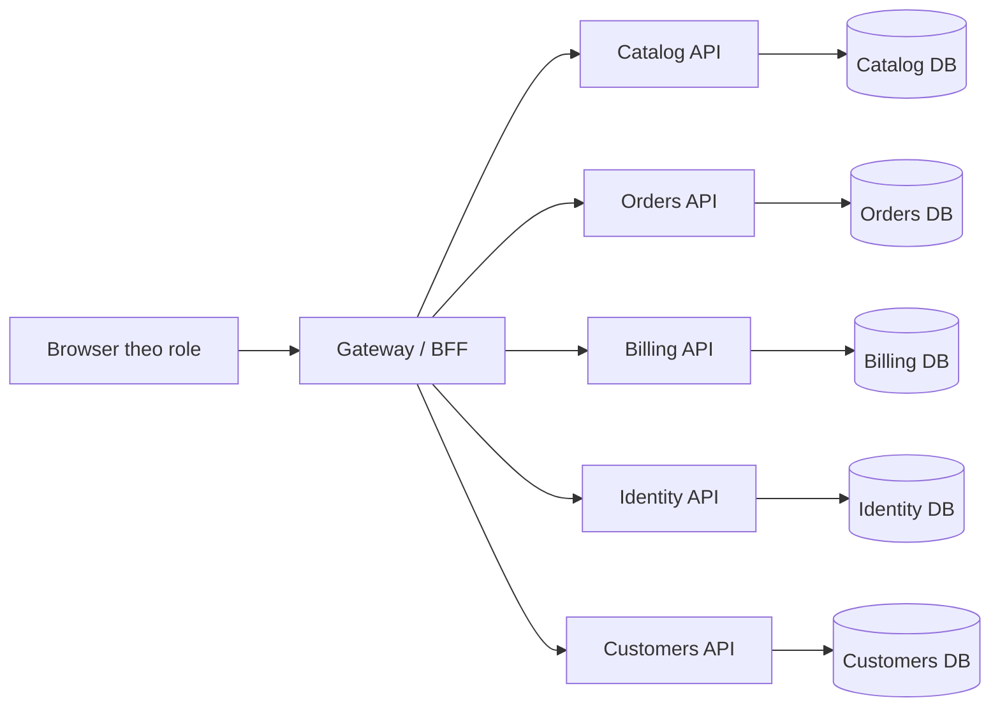

# Phân tích chi tiết kiến trúc SelfRestaurant

Tài liệu này phân tích kiến trúc tổng thể, ranh giới service, luồng nghiệp vụ, mô hình dữ liệu, cách tích hợp và vai trò từng file nguồn trong thư mục `src`.

## 1. Tóm tắt hệ thống

SelfRestaurant là hệ thống nhà hàng tự phục vụ được chuyển đổi từ luồng MVC sang kiến trúc service-split/microservices. MVC legacy giữ vai trò chuẩn hành vi người dùng, còn microservice giữ vai trò chuẩn ranh giới dữ liệu và quyền sở hữu domain.

Các vai trò người dùng chính gồm khách hàng, đầu bếp, thu ngân và quản trị viên. Mỗi vai trò có frontend riêng, đi qua Gateway để gọi các API nghiệp vụ phía sau.

## 2. Mô hình kiến trúc sử dụng

| Mô hình / nguyên tắc | Vai trò trong hệ thống |
|---|---|
| Client–Server | Browser chạy frontend theo vai trò; backend xử lý nghiệp vụ, lưu dữ liệu và trả kết quả qua HTTP. |
| Web Gateway / BFF | SelfRestaurant.Gateway.Api là điểm vào chính cho web app, giữ session/role, điều hướng UI, validate request, gọi service phía sau và tổng hợp DTO trả về. |
| Microservices | Hệ thống tách thành Catalog, Orders, Billing, Customers, Identity; mỗi service tập trung vào một miền nghiệp vụ. |
| Service decomposition theo domain | Mỗi service tương ứng bounded context: món/nguyên liệu, đơn hàng, thanh toán, danh tính, khách hàng. |
| Layered Architecture | Trong mỗi service có Controller, Infrastructure, Persistence, Entities, Bootstrap/Migrations. |
| Database-per-service | Mỗi service có database riêng như RESTAURANT_CATALOG, RESTAURANT_ORDERS, RESTAURANT_BILLING, RESTAURANT_CUSTOMERS, RESTAURANT_IDENTITY. |
| REST-based Integration | Gateway và service giao tiếp chủ yếu bằng HTTP/REST để đơn giản hóa triển khai và debug. |
| Event-driven / Outbox-Inbox | Một số flow dùng event/outbox/inbox để đồng bộ trạng thái như payment completed, order ready. |
| CQRS-lite / Read Model | Service lưu snapshot/read model của dữ liệu service khác để đọc nhanh mà không query chéo DB. |
| Strangler Fig Migration | Hệ thống đang tách dần từ MVC/legacy DB sang service ownership, không rewrite toàn bộ một lần. |
| Role-based UI Architecture | Frontend chia theo vai trò Admin/Cashier/Chef/Customer để cô lập flow màn hình và quyền truy cập. |

## 3. Service ownership

| Service | Sở hữu nghiệp vụ | Không nên làm |
|---|---|---|
| Catalog | Menu, bàn, món ăn, danh mục, nguyên liệu, công thức món, tồn kho. | Không xử lý vòng đời đơn hàng hoặc thanh toán. |
| Orders | Đơn hàng, order item, trạng thái bếp, override thành phần theo từng order item. | Không FK trực tiếp sang Catalog Ingredients; chỉ lưu external id/snapshot. |
| Billing | Checkout, hóa đơn, thanh toán, báo cáo doanh thu. | Không sửa công thức món hoặc trạng thái bếp tùy tiện. |
| Identity | Đăng nhập, nhân viên, role, reset password, thông tin tài khoản. | Không xử lý order/catalog/payment. |
| Customers | Khách hàng, loyalty/read model, thông báo món sẵn sàng. | Không sở hữu hóa đơn hoặc order lifecycle. |
| Gateway | Điều phối web flow, session, tổng hợp response, route theo role. | Không tái tạo direct cross-domain DB access. |

## 4. Luồng request tổng quát

## 5. Luồng nghiệp vụ chính

### 5.1 Khách đặt món
1. Customer frontend mở menu theo bàn/QR.
2. Gateway gọi Catalog để lấy menu, món, trạng thái khả dụng.
3. Khách thêm món và submit order.
4. Gateway gọi Orders để tạo hoặc cập nhật Orders và OrderItems.
5. Orders kiểm tra tính hợp lệ, có thể gọi Catalog để validate món/nguyên liệu.

### 5.2 Bếp xử lý đơn
1. Chef frontend gọi Gateway lấy dashboard bếp.
2. Gateway gọi Orders lấy order active theo chi nhánh, gọi Catalog enrich tên món/thành phần nếu cần.
3. Đầu bếp bấm bắt đầu/hoàn thành/hủy món.
4. Gateway gọi Orders update trạng thái item/order.

### 5.3 Override thành phần món trong đơn
1. Chef mở modal thành phần cho một OrderItems.ItemID.
2. Gateway lấy công thức gốc từ Catalog và override hiện tại từ Orders.
3. Khi lưu, Gateway gửi IngredientID external Catalog reference cùng snapshot tên/unit/quantity.
4. Orders lưu vào OrderItemIngredients theo OrderItemID -> OrderItems.ItemID.
5. Công thức gốc trong Catalog không bị sửa.

### 5.4 Thu ngân thanh toán
1. Cashier frontend lấy bàn/đơn đang active.
2. Gateway gọi Orders để lấy order detail.
3. Cashier áp giảm giá/điểm/phương thức thanh toán.
4. Gateway gọi Billing checkout.
5. Billing lưu bill/payment và có thể phát event để Orders/Customers cập nhật.

### 5.5 Admin quản trị
1. Admin frontend gọi Gateway.
2. Gateway kiểm tra role admin.
3. Gateway gọi Catalog/Identity/Customers/Billing/Orders theo module quản trị.
4. Mỗi service chỉ cập nhật dữ liệu thuộc quyền sở hữu của mình.

## 6. Phân tích các frontend theo vai trò

- Admin web: quản trị danh mục, món, nguyên liệu, tồn kho, đơn vị tính, nhân viên, khách hàng.
- Cashier web: POS/thu ngân, chọn bàn, xem order, tính tiền, QR, báo cáo, lịch sử.
- Chef web: KDS/bếp, kanban đơn chờ/đang chế biến/sẵn sàng, modal thành phần, kho nguyên liệu.
- Customer web: xem menu, đặt món QR/bàn, đăng nhập, lịch sử đơn, theo dõi trạng thái.

## 7. Phân tích database và ranh giới dữ liệu

- Catalog DB sở hữu nguyên liệu/công thức gốc.
- Orders DB sở hữu order/order item/override theo đơn.
- Billing DB sở hữu hóa đơn/thanh toán.
- Identity DB sở hữu tài khoản/nhân viên/role.
- Customers DB sở hữu khách hàng/loyalty/thông báo.
- Shared/legacy DB chỉ nên dùng khi migration hoặc tương thích, không dùng để phá service boundary.

## 8. Phân tích từng project và từng file

### Other

| File | Vai trò / chức năng |
|---|---|
| `src\Frontend\selfrestaurant-admin-web\index.html` | HTML entry cho Vite/React app. |
| `src\Frontend\selfrestaurant-admin-web\package.json` | Cấu hình frontend package, script dev/build và dependency. |
| `src\Frontend\selfrestaurant-admin-web\package-lock.json` | Khóa phiên bản dependency npm để build ổn định. |
| `src\Frontend\selfrestaurant-admin-web\src\App.tsx` | Khai báo route, layout và guard chính của frontend. |
| `src\Frontend\selfrestaurant-admin-web\src\components\AdminLayout.tsx` | File nguồn/cấu hình hỗ trợ trong project. |
| `src\Frontend\selfrestaurant-admin-web\src\components\AdminPagination.tsx` | File nguồn/cấu hình hỗ trợ trong project. |
| `src\Frontend\selfrestaurant-admin-web\src\components\AppDialog.tsx` | File nguồn/cấu hình hỗ trợ trong project. |
| `src\Frontend\selfrestaurant-admin-web\src\components\CrossAppRedirect.tsx` | File nguồn/cấu hình hỗ trợ trong project. |
| `src\Frontend\selfrestaurant-admin-web\src\components\RequireAdmin.tsx` | File nguồn/cấu hình hỗ trợ trong project. |
| `src\Frontend\selfrestaurant-admin-web\src\lib\api.ts` | File nguồn/cấu hình hỗ trợ trong project. |
| `src\Frontend\selfrestaurant-admin-web\src\lib\types.ts` | File nguồn/cấu hình hỗ trợ trong project. |
| `src\Frontend\selfrestaurant-admin-web\src\lib\useAutoDismissMessage.ts` | File nguồn/cấu hình hỗ trợ trong project. |
| `src\Frontend\selfrestaurant-admin-web\src\main.tsx` | Entry React: mount App vào DOM và nạp CSS. |
| `src\Frontend\selfrestaurant-admin-web\src\pages\AdminConsolePage.tsx` | File nguồn/cấu hình hỗ trợ trong project. |
| `src\Frontend\selfrestaurant-admin-web\src\pages\customers\CustomerActivityLogsPage.tsx` | File nguồn/cấu hình hỗ trợ trong project. |
| `src\Frontend\selfrestaurant-admin-web\src\pages\customers\CustomerEditPage.tsx` | File nguồn/cấu hình hỗ trợ trong project. |
| `src\Frontend\selfrestaurant-admin-web\src\pages\customers\CustomersCreatePage.tsx` | File nguồn/cấu hình hỗ trợ trong project. |
| `src\Frontend\selfrestaurant-admin-web\src\pages\customers\CustomersIndexPage.tsx` | File nguồn/cấu hình hỗ trợ trong project. |
| `src\Frontend\selfrestaurant-admin-web\src\pages\customers\CustomersModulePage.tsx` | File nguồn/cấu hình hỗ trợ trong project. |
| `src\Frontend\selfrestaurant-admin-web\src\pages\employees\EmployeeEditPage.tsx` | File nguồn/cấu hình hỗ trợ trong project. |
| `src\Frontend\selfrestaurant-admin-web\src\pages\employees\EmployeeHistoryPage.tsx` | File nguồn/cấu hình hỗ trợ trong project. |
| `src\Frontend\selfrestaurant-admin-web\src\pages\employees\EmployeesCreatePage.tsx` | File nguồn/cấu hình hỗ trợ trong project. |
| `src\Frontend\selfrestaurant-admin-web\src\pages\employees\EmployeesIndexPage.tsx` | File nguồn/cấu hình hỗ trợ trong project. |
| `src\Frontend\selfrestaurant-admin-web\src\pages\employees\EmployeesModulePage.tsx` | File nguồn/cấu hình hỗ trợ trong project. |
| `src\Frontend\selfrestaurant-admin-web\src\pages\ingredients\IngredientsModulePage.tsx` | File nguồn/cấu hình hỗ trợ trong project. |
| `src\Frontend\selfrestaurant-admin-web\src\pages\inventory\InventoryModulePage.tsx` | File nguồn/cấu hình hỗ trợ trong project. |
| `src\Frontend\selfrestaurant-admin-web\src\pages\LoginPage.tsx` | File nguồn/cấu hình hỗ trợ trong project. |
| `src\Frontend\selfrestaurant-admin-web\src\pages\units\UnitsModulePage.tsx` | File nguồn/cấu hình hỗ trợ trong project. |
| `src\Frontend\selfrestaurant-admin-web\src\styles.css` | CSS tổng thể của app: layout, component, responsive, modal, trạng thái. |
| `src\Frontend\selfrestaurant-admin-web\tsconfig.app.json` | Cấu hình TypeScript. |
| `src\Frontend\selfrestaurant-admin-web\tsconfig.app.tsbuildinfo` | Cấu hình TypeScript. |
| `src\Frontend\selfrestaurant-admin-web\tsconfig.json` | Cấu hình TypeScript. |
| `src\Frontend\selfrestaurant-admin-web\tsconfig.node.json` | Cấu hình TypeScript. |
| `src\Frontend\selfrestaurant-admin-web\tsconfig.node.tsbuildinfo` | Cấu hình TypeScript. |
| `src\Frontend\selfrestaurant-admin-web\vite.config.d.ts` | Cấu hình Vite build/dev server/proxy/base path. |
| `src\Frontend\selfrestaurant-admin-web\vite.config.js` | Cấu hình Vite build/dev server/proxy/base path. |
| `src\Frontend\selfrestaurant-admin-web\vite.config.ts` | Cấu hình Vite build/dev server/proxy/base path. |
| `src\Frontend\selfrestaurant-cashier-web\index.html` | HTML entry cho Vite/React app. |
| `src\Frontend\selfrestaurant-cashier-web\package.json` | Cấu hình frontend package, script dev/build và dependency. |
| `src\Frontend\selfrestaurant-cashier-web\package-lock.json` | Khóa phiên bản dependency npm để build ổn định. |
| `src\Frontend\selfrestaurant-cashier-web\src\App.tsx` | Khai báo route, layout và guard chính của frontend. |
| `src\Frontend\selfrestaurant-cashier-web\src\components\AppDialog.tsx` | File nguồn/cấu hình hỗ trợ trong project. |
| `src\Frontend\selfrestaurant-cashier-web\src\components\CrossAppRedirect.tsx` | File nguồn/cấu hình hỗ trợ trong project. |
| `src\Frontend\selfrestaurant-cashier-web\src\components\RequireCashier.tsx` | File nguồn/cấu hình hỗ trợ trong project. |
| `src\Frontend\selfrestaurant-cashier-web\src\lib\api.ts` | File nguồn/cấu hình hỗ trợ trong project. |
| `src\Frontend\selfrestaurant-cashier-web\src\lib\types.ts` | File nguồn/cấu hình hỗ trợ trong project. |
| `src\Frontend\selfrestaurant-cashier-web\src\lib\vietQr.ts` | File nguồn/cấu hình hỗ trợ trong project. |
| `src\Frontend\selfrestaurant-cashier-web\src\main.tsx` | Entry React: mount App vào DOM và nạp CSS. |
| `src\Frontend\selfrestaurant-cashier-web\src\pages\DashboardPage.tsx` | File nguồn/cấu hình hỗ trợ trong project. |
| `src\Frontend\selfrestaurant-cashier-web\src\pages\HistoryPage.tsx` | File nguồn/cấu hình hỗ trợ trong project. |
| `src\Frontend\selfrestaurant-cashier-web\src\pages\LoginPage.tsx` | File nguồn/cấu hình hỗ trợ trong project. |
| `src\Frontend\selfrestaurant-cashier-web\src\pages\ReportPage.tsx` | File nguồn/cấu hình hỗ trợ trong project. |
| `src\Frontend\selfrestaurant-cashier-web\src\styles.css` | CSS tổng thể của app: layout, component, responsive, modal, trạng thái. |
| `src\Frontend\selfrestaurant-cashier-web\tsconfig.app.json` | Cấu hình TypeScript. |
| `src\Frontend\selfrestaurant-cashier-web\tsconfig.app.tsbuildinfo` | Cấu hình TypeScript. |
| `src\Frontend\selfrestaurant-cashier-web\tsconfig.json` | Cấu hình TypeScript. |
| `src\Frontend\selfrestaurant-cashier-web\tsconfig.node.json` | Cấu hình TypeScript. |
| `src\Frontend\selfrestaurant-cashier-web\tsconfig.node.tsbuildinfo` | Cấu hình TypeScript. |
| `src\Frontend\selfrestaurant-cashier-web\vite.config.d.ts` | Cấu hình Vite build/dev server/proxy/base path. |
| `src\Frontend\selfrestaurant-cashier-web\vite.config.js` | Cấu hình Vite build/dev server/proxy/base path. |
| `src\Frontend\selfrestaurant-cashier-web\vite.config.ts` | Cấu hình Vite build/dev server/proxy/base path. |
| `src\Frontend\selfrestaurant-chef-web\index.html` | HTML entry cho Vite/React app. |
| `src\Frontend\selfrestaurant-chef-web\package.json` | Cấu hình frontend package, script dev/build và dependency. |
| `src\Frontend\selfrestaurant-chef-web\package-lock.json` | Khóa phiên bản dependency npm để build ổn định. |
| `src\Frontend\selfrestaurant-chef-web\src\App.tsx` | Khai báo route, layout và guard chính của frontend. |
| `src\Frontend\selfrestaurant-chef-web\src\components\AppDialog.tsx` | File nguồn/cấu hình hỗ trợ trong project. |
| `src\Frontend\selfrestaurant-chef-web\src\components\CrossAppRedirect.tsx` | File nguồn/cấu hình hỗ trợ trong project. |
| `src\Frontend\selfrestaurant-chef-web\src\components\RequireChef.tsx` | File nguồn/cấu hình hỗ trợ trong project. |
| `src\Frontend\selfrestaurant-chef-web\src\lib\api.ts` | File nguồn/cấu hình hỗ trợ trong project. |
| `src\Frontend\selfrestaurant-chef-web\src\lib\types.ts` | File nguồn/cấu hình hỗ trợ trong project. |
| `src\Frontend\selfrestaurant-chef-web\src\main.tsx` | Entry React: mount App vào DOM và nạp CSS. |
| `src\Frontend\selfrestaurant-chef-web\src\pages\DashboardPage.tsx` | File nguồn/cấu hình hỗ trợ trong project. |
| `src\Frontend\selfrestaurant-chef-web\src\pages\ForgotPasswordPage.tsx` | File nguồn/cấu hình hỗ trợ trong project. |
| `src\Frontend\selfrestaurant-chef-web\src\pages\LoginPage.tsx` | File nguồn/cấu hình hỗ trợ trong project. |
| `src\Frontend\selfrestaurant-chef-web\src\pages\ResetPasswordPage.tsx` | File nguồn/cấu hình hỗ trợ trong project. |
| `src\Frontend\selfrestaurant-chef-web\src\styles.css` | CSS tổng thể của app: layout, component, responsive, modal, trạng thái. |
| `src\Frontend\selfrestaurant-chef-web\tsconfig.app.json` | Cấu hình TypeScript. |
| `src\Frontend\selfrestaurant-chef-web\tsconfig.app.tsbuildinfo` | Cấu hình TypeScript. |
| `src\Frontend\selfrestaurant-chef-web\tsconfig.json` | Cấu hình TypeScript. |
| `src\Frontend\selfrestaurant-chef-web\tsconfig.node.json` | Cấu hình TypeScript. |
| `src\Frontend\selfrestaurant-chef-web\tsconfig.node.tsbuildinfo` | Cấu hình TypeScript. |
| `src\Frontend\selfrestaurant-chef-web\vite.config.d.ts` | Cấu hình Vite build/dev server/proxy/base path. |
| `src\Frontend\selfrestaurant-chef-web\vite.config.js` | Cấu hình Vite build/dev server/proxy/base path. |
| `src\Frontend\selfrestaurant-chef-web\vite.config.ts` | Cấu hình Vite build/dev server/proxy/base path. |
| `src\Frontend\selfrestaurant-customer-web\.env.local` | File nguồn/cấu hình hỗ trợ trong project. |
| `src\Frontend\selfrestaurant-customer-web\index.html` | HTML entry cho Vite/React app. |
| `src\Frontend\selfrestaurant-customer-web\package.json` | Cấu hình frontend package, script dev/build và dependency. |
| `src\Frontend\selfrestaurant-customer-web\package-lock.json` | Khóa phiên bản dependency npm để build ổn định. |
| `src\Frontend\selfrestaurant-customer-web\src\App.tsx` | Khai báo route, layout và guard chính của frontend. |
| `src\Frontend\selfrestaurant-customer-web\src\components\AppDialog.tsx` | File nguồn/cấu hình hỗ trợ trong project. |
| `src\Frontend\selfrestaurant-customer-web\src\components\ErrorBoundary.tsx` | File nguồn/cấu hình hỗ trợ trong project. |
| `src\Frontend\selfrestaurant-customer-web\src\components\Layout.tsx` | File nguồn/cấu hình hỗ trợ trong project. |
| `src\Frontend\selfrestaurant-customer-web\src\components\PublicNavbar.tsx` | File nguồn/cấu hình hỗ trợ trong project. |
| `src\Frontend\selfrestaurant-customer-web\src\components\RequireAuth.tsx` | File nguồn/cấu hình hỗ trợ trong project. |
| `src\Frontend\selfrestaurant-customer-web\src\components\SiteFooter.tsx` | File nguồn/cấu hình hỗ trợ trong project. |
| `src\Frontend\selfrestaurant-customer-web\src\lib\api.ts` | File nguồn/cấu hình hỗ trợ trong project. |
| `src\Frontend\selfrestaurant-customer-web\src\lib\guestCart.ts` | File nguồn/cấu hình hỗ trợ trong project. |
| `src\Frontend\selfrestaurant-customer-web\src\lib\mvcPaths.ts` | File nguồn/cấu hình hỗ trợ trong project. |
| `src\Frontend\selfrestaurant-customer-web\src\lib\persistentTable.ts` | File nguồn/cấu hình hỗ trợ trong project. |
| `src\Frontend\selfrestaurant-customer-web\src\lib\types.ts` | File nguồn/cấu hình hỗ trợ trong project. |
| `src\Frontend\selfrestaurant-customer-web\src\main.tsx` | Entry React: mount App vào DOM và nạp CSS. |
| `src\Frontend\selfrestaurant-customer-web\src\pages\AboutPage.tsx` | File nguồn/cấu hình hỗ trợ trong project. |
| `src\Frontend\selfrestaurant-customer-web\src\pages\ContactPage.tsx` | File nguồn/cấu hình hỗ trợ trong project. |
| `src\Frontend\selfrestaurant-customer-web\src\pages\DashboardPage.tsx` | File nguồn/cấu hình hỗ trợ trong project. |
| `src\Frontend\selfrestaurant-customer-web\src\pages\ForgotPasswordPage.tsx` | File nguồn/cấu hình hỗ trợ trong project. |
| `src\Frontend\selfrestaurant-customer-web\src\pages\HomePage.tsx` | File nguồn/cấu hình hỗ trợ trong project. |
| `src\Frontend\selfrestaurant-customer-web\src\pages\LoginPage.tsx` | File nguồn/cấu hình hỗ trợ trong project. |
| `src\Frontend\selfrestaurant-customer-web\src\pages\MenuFromQrPage.tsx` | File nguồn/cấu hình hỗ trợ trong project. |
| `src\Frontend\selfrestaurant-customer-web\src\pages\MenuIndexPage.tsx` | File nguồn/cấu hình hỗ trợ trong project. |
| `src\Frontend\selfrestaurant-customer-web\src\pages\MenuPage.tsx` | File nguồn/cấu hình hỗ trợ trong project. |
| `src\Frontend\selfrestaurant-customer-web\src\pages\OrderIndexPage.tsx` | File nguồn/cấu hình hỗ trợ trong project. |
| `src\Frontend\selfrestaurant-customer-web\src\pages\OrderPage.tsx` | File nguồn/cấu hình hỗ trợ trong project. |
| `src\Frontend\selfrestaurant-customer-web\src\pages\OrdersPage.tsx` | File nguồn/cấu hình hỗ trợ trong project. |
| `src\Frontend\selfrestaurant-customer-web\src\pages\RegisterPage.tsx` | File nguồn/cấu hình hỗ trợ trong project. |
| `src\Frontend\selfrestaurant-customer-web\src\pages\ResetPasswordPage.tsx` | File nguồn/cấu hình hỗ trợ trong project. |
| `src\Frontend\selfrestaurant-customer-web\src\styles.css` | CSS tổng thể của app: layout, component, responsive, modal, trạng thái. |
| `src\Frontend\selfrestaurant-customer-web\src\vite-env.d.ts` | File nguồn/cấu hình hỗ trợ trong project. |
| `src\Frontend\selfrestaurant-customer-web\tsconfig.app.json` | Cấu hình TypeScript. |
| `src\Frontend\selfrestaurant-customer-web\tsconfig.app.tsbuildinfo` | Cấu hình TypeScript. |
| `src\Frontend\selfrestaurant-customer-web\tsconfig.json` | Cấu hình TypeScript. |
| `src\Frontend\selfrestaurant-customer-web\tsconfig.node.json` | Cấu hình TypeScript. |
| `src\Frontend\selfrestaurant-customer-web\tsconfig.node.tsbuildinfo` | Cấu hình TypeScript. |
| `src\Frontend\selfrestaurant-customer-web\vite.config.d.ts` | Cấu hình Vite build/dev server/proxy/base path. |
| `src\Frontend\selfrestaurant-customer-web\vite.config.js` | Cấu hình Vite build/dev server/proxy/base path. |
| `src\Frontend\selfrestaurant-customer-web\vite.config.ts` | Cấu hình Vite build/dev server/proxy/base path. |
| `src\Gateway\SelfRestaurant.Gateway.Api\appsettings.json` | Cấu hình runtime chính: connection string, URL service phụ thuộc, logging, feature flags. |
| `src\Gateway\SelfRestaurant.Gateway.Api\Controllers\AdminGatewayController.cs` | File nguồn/cấu hình hỗ trợ trong project. |
| `src\Gateway\SelfRestaurant.Gateway.Api\Controllers\CustomerGatewayController.cs` | File nguồn/cấu hình hỗ trợ trong project. |
| `src\Gateway\SelfRestaurant.Gateway.Api\Controllers\StaffCashierGatewayController.cs` | File nguồn/cấu hình hỗ trợ trong project. |
| `src\Gateway\SelfRestaurant.Gateway.Api\Controllers\StaffChefGatewayController.cs` | File nguồn/cấu hình hỗ trợ trong project. |
| `src\Gateway\SelfRestaurant.Gateway.Api\Dockerfile` | Cấu hình build và chạy service bằng container. |
| `src\Gateway\SelfRestaurant.Gateway.Api\Hubs\CustomerNotificationsHub.cs` | File nguồn/cấu hình hỗ trợ trong project. |
| `src\Gateway\SelfRestaurant.Gateway.Api\Infrastructure\ActorContextHandler.cs` | File nguồn/cấu hình hỗ trợ trong project. |
| `src\Gateway\SelfRestaurant.Gateway.Api\Infrastructure\CorrelationIdHandler.cs` | File nguồn/cấu hình hỗ trợ trong project. |
| `src\Gateway\SelfRestaurant.Gateway.Api\Infrastructure\SessionKeys.cs` | File nguồn/cấu hình hỗ trợ trong project. |
| `src\Gateway\SelfRestaurant.Gateway.Api\Models\ApiContracts.cs` | File nguồn/cấu hình hỗ trợ trong project. |
| `src\Gateway\SelfRestaurant.Gateway.Api\Models\GatewayAdminContracts.cs` | File nguồn/cấu hình hỗ trợ trong project. |
| `src\Gateway\SelfRestaurant.Gateway.Api\Models\GatewayCustomerContracts.cs` | File nguồn/cấu hình hỗ trợ trong project. |
| `src\Gateway\SelfRestaurant.Gateway.Api\Models\GatewayStaffCashierContracts.cs` | File nguồn/cấu hình hỗ trợ trong project. |
| `src\Gateway\SelfRestaurant.Gateway.Api\Models\GatewayStaffChefContracts.cs` | File nguồn/cấu hình hỗ trợ trong project. |
| `src\Gateway\SelfRestaurant.Gateway.Api\Program.cs` | Điểm khởi động ASP.NET Core: cấu hình DI, middleware, routing, session, service URL và bootstrap. |
| `src\Gateway\SelfRestaurant.Gateway.Api\Properties\launchSettings.json` | Profile debug local và port chạy trong Visual Studio. |
| `src\Gateway\SelfRestaurant.Gateway.Api\SelfRestaurant.Gateway.Api.csproj` | File project .NET: target framework, package reference, build settings. |
| `src\Gateway\SelfRestaurant.Gateway.Api\Services\ApiClientBase.cs` | File nguồn/cấu hình hỗ trợ trong project. |
| `src\Gateway\SelfRestaurant.Gateway.Api\Services\BillingClient.cs` | File nguồn/cấu hình hỗ trợ trong project. |
| `src\Gateway\SelfRestaurant.Gateway.Api\Services\CatalogClient.cs` | File nguồn/cấu hình hỗ trợ trong project. |
| `src\Gateway\SelfRestaurant.Gateway.Api\Services\CustomerDishRecommendationService.cs` | File nguồn/cấu hình hỗ trợ trong project. |
| `src\Gateway\SelfRestaurant.Gateway.Api\Services\CustomersClient.cs` | File nguồn/cấu hình hỗ trợ trong project. |
| `src\Gateway\SelfRestaurant.Gateway.Api\Services\IdentityClient.cs` | File nguồn/cấu hình hỗ trợ trong project. |
| `src\Gateway\SelfRestaurant.Gateway.Api\Services\OrdersClient.cs` | File nguồn/cấu hình hỗ trợ trong project. |
| `src\Gateway\SelfRestaurant.Gateway.Api\wwwroot\images\ban-flan.jpg` | File nguồn/cấu hình hỗ trợ trong project. |
| `src\Gateway\SelfRestaurant.Gateway.Api\wwwroot\images\bun-bo.jpg` | File nguồn/cấu hình hỗ trợ trong project. |
| `src\Gateway\SelfRestaurant.Gateway.Api\wwwroot\images\bun-bo-hue.jpg` | File nguồn/cấu hình hỗ trợ trong project. |
| `src\Gateway\SelfRestaurant.Gateway.Api\wwwroot\images\bun-cha-ha-noi.jpg` | File nguồn/cấu hình hỗ trợ trong project. |
| `src\Gateway\SelfRestaurant.Gateway.Api\wwwroot\images\ca-phe-sua-da.jpg` | File nguồn/cấu hình hỗ trợ trong project. |
| `src\Gateway\SelfRestaurant.Gateway.Api\wwwroot\images\che-khuc-bach.jpg` | File nguồn/cấu hình hỗ trợ trong project. |
| `src\Gateway\SelfRestaurant.Gateway.Api\wwwroot\images\che-thai.jpg` | File nguồn/cấu hình hỗ trợ trong project. |
| `src\Gateway\SelfRestaurant.Gateway.Api\wwwroot\images\com-ga-xoi-mo.jpg` | File nguồn/cấu hình hỗ trợ trong project. |
| `src\Gateway\SelfRestaurant.Gateway.Api\wwwroot\images\com-suon-bi-cha.jpg` | File nguồn/cấu hình hỗ trợ trong project. |
| `src\Gateway\SelfRestaurant.Gateway.Api\wwwroot\images\dish_20251202233500571.jpg` | File nguồn/cấu hình hỗ trợ trong project. |
| `src\Gateway\SelfRestaurant.Gateway.Api\wwwroot\images\dish_20251203014151691.jpg` | File nguồn/cấu hình hỗ trợ trong project. |
| `src\Gateway\SelfRestaurant.Gateway.Api\wwwroot\images\dish_20251203014217645.jpg` | File nguồn/cấu hình hỗ trợ trong project. |
| `src\Gateway\SelfRestaurant.Gateway.Api\wwwroot\images\dish_20251203014230039.jpg` | File nguồn/cấu hình hỗ trợ trong project. |
| `src\Gateway\SelfRestaurant.Gateway.Api\wwwroot\images\dish_20251203014327609.jpg` | File nguồn/cấu hình hỗ trợ trong project. |
| `src\Gateway\SelfRestaurant.Gateway.Api\wwwroot\images\dish_20251203014409795.jpg` | File nguồn/cấu hình hỗ trợ trong project. |
| `src\Gateway\SelfRestaurant.Gateway.Api\wwwroot\images\dish_20251203014435075.jpg` | File nguồn/cấu hình hỗ trợ trong project. |
| `src\Gateway\SelfRestaurant.Gateway.Api\wwwroot\images\dish_20251203014448955.jpg` | File nguồn/cấu hình hỗ trợ trong project. |
| `src\Gateway\SelfRestaurant.Gateway.Api\wwwroot\images\dish_20251203014504150.jpg` | File nguồn/cấu hình hỗ trợ trong project. |
| `src\Gateway\SelfRestaurant.Gateway.Api\wwwroot\images\dish_20251203014518088.jpg` | File nguồn/cấu hình hỗ trợ trong project. |
| `src\Gateway\SelfRestaurant.Gateway.Api\wwwroot\images\dish_20251203014537428.jpg` | File nguồn/cấu hình hỗ trợ trong project. |
| `src\Gateway\SelfRestaurant.Gateway.Api\wwwroot\images\dish_20251203014738222.jpg` | File nguồn/cấu hình hỗ trợ trong project. |
| `src\Gateway\SelfRestaurant.Gateway.Api\wwwroot\images\dish_20251203014802250.jpg` | File nguồn/cấu hình hỗ trợ trong project. |
| `src\Gateway\SelfRestaurant.Gateway.Api\wwwroot\images\dish_20251203014835783.jpg` | File nguồn/cấu hình hỗ trợ trong project. |
| `src\Gateway\SelfRestaurant.Gateway.Api\wwwroot\images\dish_20251203014851937.jpg` | File nguồn/cấu hình hỗ trợ trong project. |
| `src\Gateway\SelfRestaurant.Gateway.Api\wwwroot\images\dish_20251203014903144.jpg` | File nguồn/cấu hình hỗ trợ trong project. |
| `src\Gateway\SelfRestaurant.Gateway.Api\wwwroot\images\dish_20251203014919825.jpg` | File nguồn/cấu hình hỗ trợ trong project. |
| `src\Gateway\SelfRestaurant.Gateway.Api\wwwroot\images\dish_20251203014934154.jpg` | File nguồn/cấu hình hỗ trợ trong project. |
| `src\Gateway\SelfRestaurant.Gateway.Api\wwwroot\images\dish_20251203014944820.jpg` | File nguồn/cấu hình hỗ trợ trong project. |
| `src\Gateway\SelfRestaurant.Gateway.Api\wwwroot\images\dishes\.gitkeep` | File nguồn/cấu hình hỗ trợ trong project. |
| `src\Gateway\SelfRestaurant.Gateway.Api\wwwroot\images\dishes\bun-bo-hue.jpg` | File nguồn/cấu hình hỗ trợ trong project. |
| `src\Gateway\SelfRestaurant.Gateway.Api\wwwroot\images\dishes\cha-ca.jpg` | File nguồn/cấu hình hỗ trợ trong project. |
| `src\Gateway\SelfRestaurant.Gateway.Api\wwwroot\images\dishes\dbgupload20260413194155.svg` | File nguồn/cấu hình hỗ trợ trong project. |
| `src\Gateway\SelfRestaurant.Gateway.Api\wwwroot\images\dishes\nuoc-cam-vat.jpg` | File nguồn/cấu hình hỗ trợ trong project. |
| `src\Gateway\SelfRestaurant.Gateway.Api\wwwroot\images\dishes\README.md` | File nguồn/cấu hình hỗ trợ trong project. |
| `src\Gateway\SelfRestaurant.Gateway.Api\wwwroot\images\dishes\uploaddish20260413194118.svg` | File nguồn/cấu hình hỗ trợ trong project. |
| `src\Gateway\SelfRestaurant.Gateway.Api\wwwroot\images\dishes\uploaddish20260413194520.svg` | File nguồn/cấu hình hỗ trợ trong project. |
| `src\Gateway\SelfRestaurant.Gateway.Api\wwwroot\images\dishes\uploaddish20260413194742.png` | File nguồn/cấu hình hỗ trợ trong project. |
| `src\Gateway\SelfRestaurant.Gateway.Api\wwwroot\images\dishes\uploaddish20260413225836.png` | File nguồn/cấu hình hỗ trợ trong project. |
| `src\Gateway\SelfRestaurant.Gateway.Api\wwwroot\images\dishes\uploaddish20260413230024.png` | File nguồn/cấu hình hỗ trợ trong project. |
| `src\Gateway\SelfRestaurant.Gateway.Api\wwwroot\images\dishes\uploaddish20260413230025.png` | File nguồn/cấu hình hỗ trợ trong project. |
| `src\Gateway\SelfRestaurant.Gateway.Api\wwwroot\images\goi-cuon.jpg` | File nguồn/cấu hình hỗ trợ trong project. |
| `src\Gateway\SelfRestaurant.Gateway.Api\wwwroot\images\hu-tieu-nam-vang.jpg` | File nguồn/cấu hình hỗ trợ trong project. |
| `src\Gateway\SelfRestaurant.Gateway.Api\wwwroot\images\mi-xao-bo.jpg` | File nguồn/cấu hình hỗ trợ trong project. |
| `src\Gateway\SelfRestaurant.Gateway.Api\wwwroot\images\nem-ran.jpg` | File nguồn/cấu hình hỗ trợ trong project. |
| `src\Gateway\SelfRestaurant.Gateway.Api\wwwroot\images\nuoc-cam-vat.jpg` | File nguồn/cấu hình hỗ trợ trong project. |
| `src\Gateway\SelfRestaurant.Gateway.Api\wwwroot\images\placeholder-dish.svg` | File nguồn/cấu hình hỗ trợ trong project. |
| `src\Gateway\SelfRestaurant.Gateway.Api\wwwroot\images\salad-rau-cu.jpg` | File nguồn/cấu hình hỗ trợ trong project. |
| `src\Gateway\SelfRestaurant.Gateway.Api\wwwroot\images\sinh-to-bo.jpg` | File nguồn/cấu hình hỗ trợ trong project. |
| `src\Gateway\SelfRestaurant.Gateway.Api\wwwroot\images\tra-da.jpg` | File nguồn/cấu hình hỗ trợ trong project. |
| `src\Gateway\SelfRestaurant.Gateway.Api\wwwroot\legacy-mvc\Content\bootstrap.css` | File nguồn/cấu hình hỗ trợ trong project. |
| `src\Gateway\SelfRestaurant.Gateway.Api\wwwroot\legacy-mvc\Content\bootstrap.css.map` | File nguồn/cấu hình hỗ trợ trong project. |
| `src\Gateway\SelfRestaurant.Gateway.Api\wwwroot\legacy-mvc\Content\bootstrap.min.css` | File nguồn/cấu hình hỗ trợ trong project. |
| `src\Gateway\SelfRestaurant.Gateway.Api\wwwroot\legacy-mvc\Content\bootstrap.min.css.map` | File nguồn/cấu hình hỗ trợ trong project. |
| `src\Gateway\SelfRestaurant.Gateway.Api\wwwroot\legacy-mvc\Content\bootstrap.rtl.css` | File nguồn/cấu hình hỗ trợ trong project. |
| `src\Gateway\SelfRestaurant.Gateway.Api\wwwroot\legacy-mvc\Content\bootstrap.rtl.css.map` | File nguồn/cấu hình hỗ trợ trong project. |
| `src\Gateway\SelfRestaurant.Gateway.Api\wwwroot\legacy-mvc\Content\bootstrap.rtl.min.css` | File nguồn/cấu hình hỗ trợ trong project. |
| `src\Gateway\SelfRestaurant.Gateway.Api\wwwroot\legacy-mvc\Content\bootstrap.rtl.min.css.map` | File nguồn/cấu hình hỗ trợ trong project. |
| `src\Gateway\SelfRestaurant.Gateway.Api\wwwroot\legacy-mvc\Content\bootstrap-grid.css` | File nguồn/cấu hình hỗ trợ trong project. |
| `src\Gateway\SelfRestaurant.Gateway.Api\wwwroot\legacy-mvc\Content\bootstrap-grid.css.map` | File nguồn/cấu hình hỗ trợ trong project. |
| `src\Gateway\SelfRestaurant.Gateway.Api\wwwroot\legacy-mvc\Content\bootstrap-grid.min.css` | File nguồn/cấu hình hỗ trợ trong project. |
| `src\Gateway\SelfRestaurant.Gateway.Api\wwwroot\legacy-mvc\Content\bootstrap-grid.min.css.map` | File nguồn/cấu hình hỗ trợ trong project. |
| `src\Gateway\SelfRestaurant.Gateway.Api\wwwroot\legacy-mvc\Content\bootstrap-grid.rtl.css` | File nguồn/cấu hình hỗ trợ trong project. |
| `src\Gateway\SelfRestaurant.Gateway.Api\wwwroot\legacy-mvc\Content\bootstrap-grid.rtl.css.map` | File nguồn/cấu hình hỗ trợ trong project. |
| `src\Gateway\SelfRestaurant.Gateway.Api\wwwroot\legacy-mvc\Content\bootstrap-grid.rtl.min.css` | File nguồn/cấu hình hỗ trợ trong project. |
| `src\Gateway\SelfRestaurant.Gateway.Api\wwwroot\legacy-mvc\Content\bootstrap-grid.rtl.min.css.map` | File nguồn/cấu hình hỗ trợ trong project. |
| `src\Gateway\SelfRestaurant.Gateway.Api\wwwroot\legacy-mvc\Content\bootstrap-reboot.css` | File nguồn/cấu hình hỗ trợ trong project. |
| `src\Gateway\SelfRestaurant.Gateway.Api\wwwroot\legacy-mvc\Content\bootstrap-reboot.css.map` | File nguồn/cấu hình hỗ trợ trong project. |
| `src\Gateway\SelfRestaurant.Gateway.Api\wwwroot\legacy-mvc\Content\bootstrap-reboot.min.css` | File nguồn/cấu hình hỗ trợ trong project. |
| `src\Gateway\SelfRestaurant.Gateway.Api\wwwroot\legacy-mvc\Content\bootstrap-reboot.min.css.map` | File nguồn/cấu hình hỗ trợ trong project. |
| `src\Gateway\SelfRestaurant.Gateway.Api\wwwroot\legacy-mvc\Content\bootstrap-reboot.rtl.css` | File nguồn/cấu hình hỗ trợ trong project. |
| `src\Gateway\SelfRestaurant.Gateway.Api\wwwroot\legacy-mvc\Content\bootstrap-reboot.rtl.css.map` | File nguồn/cấu hình hỗ trợ trong project. |
| `src\Gateway\SelfRestaurant.Gateway.Api\wwwroot\legacy-mvc\Content\bootstrap-reboot.rtl.min.css` | File nguồn/cấu hình hỗ trợ trong project. |
| `src\Gateway\SelfRestaurant.Gateway.Api\wwwroot\legacy-mvc\Content\bootstrap-reboot.rtl.min.css.map` | File nguồn/cấu hình hỗ trợ trong project. |
| `src\Gateway\SelfRestaurant.Gateway.Api\wwwroot\legacy-mvc\Content\bootstrap-utilities.css` | File nguồn/cấu hình hỗ trợ trong project. |
| `src\Gateway\SelfRestaurant.Gateway.Api\wwwroot\legacy-mvc\Content\bootstrap-utilities.css.map` | File nguồn/cấu hình hỗ trợ trong project. |
| `src\Gateway\SelfRestaurant.Gateway.Api\wwwroot\legacy-mvc\Content\bootstrap-utilities.min.css` | File nguồn/cấu hình hỗ trợ trong project. |
| `src\Gateway\SelfRestaurant.Gateway.Api\wwwroot\legacy-mvc\Content\bootstrap-utilities.min.css.map` | File nguồn/cấu hình hỗ trợ trong project. |
| `src\Gateway\SelfRestaurant.Gateway.Api\wwwroot\legacy-mvc\Content\bootstrap-utilities.rtl.css` | File nguồn/cấu hình hỗ trợ trong project. |
| `src\Gateway\SelfRestaurant.Gateway.Api\wwwroot\legacy-mvc\Content\bootstrap-utilities.rtl.css.map` | File nguồn/cấu hình hỗ trợ trong project. |
| `src\Gateway\SelfRestaurant.Gateway.Api\wwwroot\legacy-mvc\Content\bootstrap-utilities.rtl.min.css` | File nguồn/cấu hình hỗ trợ trong project. |
| `src\Gateway\SelfRestaurant.Gateway.Api\wwwroot\legacy-mvc\Content\bootstrap-utilities.rtl.min.css.map` | File nguồn/cấu hình hỗ trợ trong project. |
| `src\Gateway\SelfRestaurant.Gateway.Api\wwwroot\legacy-mvc\Content\Site.css` | File nguồn/cấu hình hỗ trợ trong project. |
| `src\Gateway\SelfRestaurant.Gateway.Api\wwwroot\legacy-mvc\Images\ban-flan.jpg` | File nguồn/cấu hình hỗ trợ trong project. |
| `src\Gateway\SelfRestaurant.Gateway.Api\wwwroot\legacy-mvc\Images\bun-bo.jpg` | File nguồn/cấu hình hỗ trợ trong project. |
| `src\Gateway\SelfRestaurant.Gateway.Api\wwwroot\legacy-mvc\Images\bun-bo-hue.jpg` | File nguồn/cấu hình hỗ trợ trong project. |
| `src\Gateway\SelfRestaurant.Gateway.Api\wwwroot\legacy-mvc\Images\bun-cha-ha-noi.jpg` | File nguồn/cấu hình hỗ trợ trong project. |
| `src\Gateway\SelfRestaurant.Gateway.Api\wwwroot\legacy-mvc\Images\ca-phe-sua-da.jpg` | File nguồn/cấu hình hỗ trợ trong project. |
| `src\Gateway\SelfRestaurant.Gateway.Api\wwwroot\legacy-mvc\Images\che-khuc-bach.jpg` | File nguồn/cấu hình hỗ trợ trong project. |
| `src\Gateway\SelfRestaurant.Gateway.Api\wwwroot\legacy-mvc\Images\che-thai.jpg` | File nguồn/cấu hình hỗ trợ trong project. |
| `src\Gateway\SelfRestaurant.Gateway.Api\wwwroot\legacy-mvc\Images\com-ga-xoi-mo.jpg` | File nguồn/cấu hình hỗ trợ trong project. |
| `src\Gateway\SelfRestaurant.Gateway.Api\wwwroot\legacy-mvc\Images\com-suon-bi-cha.jpg` | File nguồn/cấu hình hỗ trợ trong project. |
| `src\Gateway\SelfRestaurant.Gateway.Api\wwwroot\legacy-mvc\Images\dish_20251202233500571.jpg` | File nguồn/cấu hình hỗ trợ trong project. |
| `src\Gateway\SelfRestaurant.Gateway.Api\wwwroot\legacy-mvc\Images\dish_20251203014151691.jpg` | File nguồn/cấu hình hỗ trợ trong project. |
| `src\Gateway\SelfRestaurant.Gateway.Api\wwwroot\legacy-mvc\Images\dish_20251203014217645.jpg` | File nguồn/cấu hình hỗ trợ trong project. |
| `src\Gateway\SelfRestaurant.Gateway.Api\wwwroot\legacy-mvc\Images\dish_20251203014230039.jpg` | File nguồn/cấu hình hỗ trợ trong project. |
| `src\Gateway\SelfRestaurant.Gateway.Api\wwwroot\legacy-mvc\Images\dish_20251203014327609.jpg` | File nguồn/cấu hình hỗ trợ trong project. |
| `src\Gateway\SelfRestaurant.Gateway.Api\wwwroot\legacy-mvc\Images\dish_20251203014409795.jpg` | File nguồn/cấu hình hỗ trợ trong project. |
| `src\Gateway\SelfRestaurant.Gateway.Api\wwwroot\legacy-mvc\Images\dish_20251203014435075.jpg` | File nguồn/cấu hình hỗ trợ trong project. |
| `src\Gateway\SelfRestaurant.Gateway.Api\wwwroot\legacy-mvc\Images\dish_20251203014448955.jpg` | File nguồn/cấu hình hỗ trợ trong project. |
| `src\Gateway\SelfRestaurant.Gateway.Api\wwwroot\legacy-mvc\Images\dish_20251203014504150.jpg` | File nguồn/cấu hình hỗ trợ trong project. |
| `src\Gateway\SelfRestaurant.Gateway.Api\wwwroot\legacy-mvc\Images\dish_20251203014518088.jpg` | File nguồn/cấu hình hỗ trợ trong project. |
| `src\Gateway\SelfRestaurant.Gateway.Api\wwwroot\legacy-mvc\Images\dish_20251203014537428.jpg` | File nguồn/cấu hình hỗ trợ trong project. |
| `src\Gateway\SelfRestaurant.Gateway.Api\wwwroot\legacy-mvc\Images\dish_20251203014738222.jpg` | File nguồn/cấu hình hỗ trợ trong project. |
| `src\Gateway\SelfRestaurant.Gateway.Api\wwwroot\legacy-mvc\Images\dish_20251203014802250.jpg` | File nguồn/cấu hình hỗ trợ trong project. |
| `src\Gateway\SelfRestaurant.Gateway.Api\wwwroot\legacy-mvc\Images\dish_20251203014835783.jpg` | File nguồn/cấu hình hỗ trợ trong project. |
| `src\Gateway\SelfRestaurant.Gateway.Api\wwwroot\legacy-mvc\Images\dish_20251203014851937.jpg` | File nguồn/cấu hình hỗ trợ trong project. |
| `src\Gateway\SelfRestaurant.Gateway.Api\wwwroot\legacy-mvc\Images\dish_20251203014903144.jpg` | File nguồn/cấu hình hỗ trợ trong project. |
| `src\Gateway\SelfRestaurant.Gateway.Api\wwwroot\legacy-mvc\Images\dish_20251203014919825.jpg` | File nguồn/cấu hình hỗ trợ trong project. |
| `src\Gateway\SelfRestaurant.Gateway.Api\wwwroot\legacy-mvc\Images\dish_20251203014934154.jpg` | File nguồn/cấu hình hỗ trợ trong project. |
| `src\Gateway\SelfRestaurant.Gateway.Api\wwwroot\legacy-mvc\Images\dish_20251203014944820.jpg` | File nguồn/cấu hình hỗ trợ trong project. |
| `src\Gateway\SelfRestaurant.Gateway.Api\wwwroot\legacy-mvc\Images\goi-cuon.jpg` | File nguồn/cấu hình hỗ trợ trong project. |
| `src\Gateway\SelfRestaurant.Gateway.Api\wwwroot\legacy-mvc\Images\hu-tieu-nam-vang.jpg` | File nguồn/cấu hình hỗ trợ trong project. |
| `src\Gateway\SelfRestaurant.Gateway.Api\wwwroot\legacy-mvc\Images\mi-xao-bo.jpg` | File nguồn/cấu hình hỗ trợ trong project. |
| `src\Gateway\SelfRestaurant.Gateway.Api\wwwroot\legacy-mvc\Images\nem-ran.jpg` | File nguồn/cấu hình hỗ trợ trong project. |
| `src\Gateway\SelfRestaurant.Gateway.Api\wwwroot\legacy-mvc\Images\nuoc-cam-vat.jpg` | File nguồn/cấu hình hỗ trợ trong project. |
| `src\Gateway\SelfRestaurant.Gateway.Api\wwwroot\legacy-mvc\Images\salad-rau-cu.jpg` | File nguồn/cấu hình hỗ trợ trong project. |
| `src\Gateway\SelfRestaurant.Gateway.Api\wwwroot\legacy-mvc\Images\sinh-to-bo.jpg` | File nguồn/cấu hình hỗ trợ trong project. |
| `src\Gateway\SelfRestaurant.Gateway.Api\wwwroot\legacy-mvc\Images\tra-da.jpg` | File nguồn/cấu hình hỗ trợ trong project. |
| `src\Services\SelfRestaurant.Billing.Api\App_Data\integration-events\billing-events-20260417.jsonl` | File nguồn/cấu hình hỗ trợ trong project. |
| `src\Services\SelfRestaurant.Billing.Api\App_Data\integration-events\billing-events-20260419.jsonl` | File nguồn/cấu hình hỗ trợ trong project. |
| `src\Services\SelfRestaurant.Billing.Api\App_Data\integration-events\billing-events-20260420.jsonl` | File nguồn/cấu hình hỗ trợ trong project. |
| `src\Services\SelfRestaurant.Billing.Api\App_Data\integration-events\billing-events-20260424.jsonl` | File nguồn/cấu hình hỗ trợ trong project. |
| `src\Services\SelfRestaurant.Billing.Api\App_Data\integration-events\billing-events-20260507.jsonl` | File nguồn/cấu hình hỗ trợ trong project. |
| `src\Services\SelfRestaurant.Billing.Api\App_Data\integration-events\billing-events-20260508.jsonl` | File nguồn/cấu hình hỗ trợ trong project. |
| `src\Services\SelfRestaurant.Billing.Api\App_Data\integration-events\billing-events-20260509.jsonl` | File nguồn/cấu hình hỗ trợ trong project. |
| `src\Services\SelfRestaurant.Billing.Api\App_Data\integration-events\billing-events-20260510.jsonl` | File nguồn/cấu hình hỗ trợ trong project. |
| `src\Services\SelfRestaurant.Billing.Api\App_Data\integration-events\billing-events-20260514.jsonl` | File nguồn/cấu hình hỗ trợ trong project. |
| `src\Services\SelfRestaurant.Billing.Api\App_Data\integration-events\billing-events-20260515.jsonl` | File nguồn/cấu hình hỗ trợ trong project. |
| `src\Services\SelfRestaurant.Billing.Api\App_Data\integration-events\billing-events-20260517.jsonl` | File nguồn/cấu hình hỗ trợ trong project. |
| `src\Services\SelfRestaurant.Billing.Api\appsettings.Development.json` | Cấu hình riêng cho môi trường Development. |
| `src\Services\SelfRestaurant.Billing.Api\appsettings.json` | Cấu hình runtime chính: connection string, URL service phụ thuộc, logging, feature flags. |
| `src\Services\SelfRestaurant.Billing.Api\Controllers\CashierBillsController.cs` | File nguồn/cấu hình hỗ trợ trong project. |
| `src\Services\SelfRestaurant.Billing.Api\Controllers\CashierController.cs` | File nguồn/cấu hình hỗ trợ trong project. |
| `src\Services\SelfRestaurant.Billing.Api\Controllers\InternalOutboxController.cs` | File nguồn/cấu hình hỗ trợ trong project. |
| `src\Services\SelfRestaurant.Billing.Api\Dockerfile` | Cấu hình build và chạy service bằng container. |
| `src\Services\SelfRestaurant.Billing.Api\Infrastructure\Auditing\BusinessAuditLogger.cs` | File nguồn/cấu hình hỗ trợ trong project. |
| `src\Services\SelfRestaurant.Billing.Api\Infrastructure\Auditing\RequestActorContext.cs` | File nguồn/cấu hình hỗ trợ trong project. |
| `src\Services\SelfRestaurant.Billing.Api\Infrastructure\Auditing\RequestActorContextAccessor.cs` | File nguồn/cấu hình hỗ trợ trong project. |
| `src\Services\SelfRestaurant.Billing.Api\Infrastructure\CustomersApiClient.cs` | File nguồn/cấu hình hỗ trợ trong project. |
| `src\Services\SelfRestaurant.Billing.Api\Infrastructure\Eventing\IntegrationEventing.cs` | File nguồn/cấu hình hỗ trợ trong project. |
| `src\Services\SelfRestaurant.Billing.Api\Infrastructure\OrdersApiClient.cs` | File nguồn/cấu hình hỗ trợ trong project. |
| `src\Services\SelfRestaurant.Billing.Api\Infrastructure\OrdersApiContracts.cs` | File nguồn/cấu hình hỗ trợ trong project. |
| `src\Services\SelfRestaurant.Billing.Api\Persistence\Bootstrap\BillingDbBootstrapper.cs` | File nguồn/cấu hình hỗ trợ trong project. |
| `src\Services\SelfRestaurant.Billing.Api\Persistence\Context\BillingDbContext.cs` | File nguồn/cấu hình hỗ trợ trong project. |
| `src\Services\SelfRestaurant.Billing.Api\Persistence\Entities\Bills.cs` | File nguồn/cấu hình hỗ trợ trong project. |
| `src\Services\SelfRestaurant.Billing.Api\Persistence\Entities\BusinessAuditLogs.cs` | File nguồn/cấu hình hỗ trợ trong project. |
| `src\Services\SelfRestaurant.Billing.Api\Persistence\Entities\CheckoutCommands.cs` | File nguồn/cấu hình hỗ trợ trong project. |
| `src\Services\SelfRestaurant.Billing.Api\Persistence\Entities\OrderContextSnapshots.cs` | File nguồn/cấu hình hỗ trợ trong project. |
| `src\Services\SelfRestaurant.Billing.Api\Persistence\Entities\OutboxEvents.cs` | File nguồn/cấu hình hỗ trợ trong project. |
| `src\Services\SelfRestaurant.Billing.Api\Program.cs` | Điểm khởi động ASP.NET Core: cấu hình DI, middleware, routing, session, service URL và bootstrap. |
| `src\Services\SelfRestaurant.Billing.Api\Properties\launchSettings.json` | Profile debug local và port chạy trong Visual Studio. |
| `src\Services\SelfRestaurant.Billing.Api\SelfRestaurant.Billing.Api.csproj` | File project .NET: target framework, package reference, build settings. |
| `src\Services\SelfRestaurant.Billing.Api\SelfRestaurant.Billing.Api.csproj.user` | File nguồn/cấu hình hỗ trợ trong project. |
| `src\Services\SelfRestaurant.Catalog.Api\appsettings.Development.json` | Cấu hình riêng cho môi trường Development. |
| `src\Services\SelfRestaurant.Catalog.Api\appsettings.json` | Cấu hình runtime chính: connection string, URL service phụ thuộc, logging, feature flags. |
| `src\Services\SelfRestaurant.Catalog.Api\Controllers\AdminCatalogController.cs` | File nguồn/cấu hình hỗ trợ trong project. |
| `src\Services\SelfRestaurant.Catalog.Api\Controllers\CatalogController.cs` | File nguồn/cấu hình hỗ trợ trong project. |
| `src\Services\SelfRestaurant.Catalog.Api\Dockerfile` | Cấu hình build và chạy service bằng container. |
| `src\Services\SelfRestaurant.Catalog.Api\Infrastructure\Auditing\BusinessAuditLogger.cs` | File nguồn/cấu hình hỗ trợ trong project. |
| `src\Services\SelfRestaurant.Catalog.Api\Infrastructure\Auditing\RequestActorContext.cs` | File nguồn/cấu hình hỗ trợ trong project. |
| `src\Services\SelfRestaurant.Catalog.Api\Infrastructure\Auditing\RequestActorContextAccessor.cs` | File nguồn/cấu hình hỗ trợ trong project. |
| `src\Services\SelfRestaurant.Catalog.Api\Infrastructure\Inventory\IngredientStockAvailabilityService.cs` | File nguồn/cấu hình hỗ trợ trong project. |
| `src\Services\SelfRestaurant.Catalog.Api\Infrastructure\Tables\TableAutoReleaseService.cs` | File nguồn/cấu hình hỗ trợ trong project. |
| `src\Services\SelfRestaurant.Catalog.Api\Persistence\Bootstrap\CatalogDbBootstrapper.cs` | File nguồn/cấu hình hỗ trợ trong project. |
| `src\Services\SelfRestaurant.Catalog.Api\Persistence\Context\CatalogDbContext.cs` | File nguồn/cấu hình hỗ trợ trong project. |
| `src\Services\SelfRestaurant.Catalog.Api\Persistence\Entities\ActiveOrders.cs` | File nguồn/cấu hình hỗ trợ trong project. |
| `src\Services\SelfRestaurant.Catalog.Api\Persistence\Entities\Bills.cs` | File nguồn/cấu hình hỗ trợ trong project. |
| `src\Services\SelfRestaurant.Catalog.Api\Persistence\Entities\Branches.cs` | File nguồn/cấu hình hỗ trợ trong project. |
| `src\Services\SelfRestaurant.Catalog.Api\Persistence\Entities\BranchRevenue.cs` | File nguồn/cấu hình hỗ trợ trong project. |
| `src\Services\SelfRestaurant.Catalog.Api\Persistence\Entities\BusinessAuditLogs.cs` | File nguồn/cấu hình hỗ trợ trong project. |
| `src\Services\SelfRestaurant.Catalog.Api\Persistence\Entities\Categories.cs` | File nguồn/cấu hình hỗ trợ trong project. |
| `src\Services\SelfRestaurant.Catalog.Api\Persistence\Entities\CategoryDish.cs` | File nguồn/cấu hình hỗ trợ trong project. |
| `src\Services\SelfRestaurant.Catalog.Api\Persistence\Entities\CustomerLoyalty.cs` | File nguồn/cấu hình hỗ trợ trong project. |
| `src\Services\SelfRestaurant.Catalog.Api\Persistence\Entities\Customers.cs` | File nguồn/cấu hình hỗ trợ trong project. |
| `src\Services\SelfRestaurant.Catalog.Api\Persistence\Entities\DiningTables.cs` | File nguồn/cấu hình hỗ trợ trong project. |
| `src\Services\SelfRestaurant.Catalog.Api\Persistence\Entities\DishDetails.cs` | File nguồn/cấu hình hỗ trợ trong project. |
| `src\Services\SelfRestaurant.Catalog.Api\Persistence\Entities\Dishes.cs` | File nguồn/cấu hình hỗ trợ trong project. |
| `src\Services\SelfRestaurant.Catalog.Api\Persistence\Entities\DishIngredients.cs` | File nguồn/cấu hình hỗ trợ trong project. |
| `src\Services\SelfRestaurant.Catalog.Api\Persistence\Entities\EmployeeRoles.cs` | File nguồn/cấu hình hỗ trợ trong project. |
| `src\Services\SelfRestaurant.Catalog.Api\Persistence\Entities\Employees.cs` | File nguồn/cấu hình hỗ trợ trong project. |
| `src\Services\SelfRestaurant.Catalog.Api\Persistence\Entities\IngredientBatches.cs` | File nguồn/cấu hình hỗ trợ trong project. |
| `src\Services\SelfRestaurant.Catalog.Api\Persistence\Entities\Ingredients.cs` | File nguồn/cấu hình hỗ trợ trong project. |
| `src\Services\SelfRestaurant.Catalog.Api\Persistence\Entities\IngredientStockMovements.cs` | File nguồn/cấu hình hỗ trợ trong project. |
| `src\Services\SelfRestaurant.Catalog.Api\Persistence\Entities\LoyaltyCards.cs` | File nguồn/cấu hình hỗ trợ trong project. |
| `src\Services\SelfRestaurant.Catalog.Api\Persistence\Entities\MenuCategory.cs` | File nguồn/cấu hình hỗ trợ trong project. |
| `src\Services\SelfRestaurant.Catalog.Api\Persistence\Entities\Menus.cs` | File nguồn/cấu hình hỗ trợ trong project. |
| `src\Services\SelfRestaurant.Catalog.Api\Persistence\Entities\OrderItemIngredients.cs` | File nguồn/cấu hình hỗ trợ trong project. |
| `src\Services\SelfRestaurant.Catalog.Api\Persistence\Entities\OrderItems.cs` | File nguồn/cấu hình hỗ trợ trong project. |
| `src\Services\SelfRestaurant.Catalog.Api\Persistence\Entities\Orders.cs` | File nguồn/cấu hình hỗ trợ trong project. |
| `src\Services\SelfRestaurant.Catalog.Api\Persistence\Entities\OrderStatus.cs` | File nguồn/cấu hình hỗ trợ trong project. |
| `src\Services\SelfRestaurant.Catalog.Api\Persistence\Entities\PasswordResetTokens.cs` | File nguồn/cấu hình hỗ trợ trong project. |
| `src\Services\SelfRestaurant.Catalog.Api\Persistence\Entities\PaymentMethod.cs` | File nguồn/cấu hình hỗ trợ trong project. |
| `src\Services\SelfRestaurant.Catalog.Api\Persistence\Entities\Payments.cs` | File nguồn/cấu hình hỗ trợ trong project. |
| `src\Services\SelfRestaurant.Catalog.Api\Persistence\Entities\PaymentStatus.cs` | File nguồn/cấu hình hỗ trợ trong project. |
| `src\Services\SelfRestaurant.Catalog.Api\Persistence\Entities\Reports.cs` | File nguồn/cấu hình hỗ trợ trong project. |
| `src\Services\SelfRestaurant.Catalog.Api\Persistence\Entities\Restaurants.cs` | File nguồn/cấu hình hỗ trợ trong project. |
| `src\Services\SelfRestaurant.Catalog.Api\Persistence\Entities\TableNumbers.cs` | File nguồn/cấu hình hỗ trợ trong project. |
| `src\Services\SelfRestaurant.Catalog.Api\Persistence\Entities\TableStatus.cs` | File nguồn/cấu hình hỗ trợ trong project. |
| `src\Services\SelfRestaurant.Catalog.Api\Persistence\Entities\Units.cs` | File nguồn/cấu hình hỗ trợ trong project. |
| `src\Services\SelfRestaurant.Catalog.Api\Program.cs` | Điểm khởi động ASP.NET Core: cấu hình DI, middleware, routing, session, service URL và bootstrap. |
| `src\Services\SelfRestaurant.Catalog.Api\Properties\launchSettings.json` | Profile debug local và port chạy trong Visual Studio. |
| `src\Services\SelfRestaurant.Catalog.Api\SelfRestaurant.Catalog.Api.csproj` | File project .NET: target framework, package reference, build settings. |
| `src\Services\SelfRestaurant.Catalog.Api\SelfRestaurant.Catalog.Api.csproj.user` | File nguồn/cấu hình hỗ trợ trong project. |
| `src\Services\SelfRestaurant.Catalog.Api\SelfRestaurant.Catalog.Api.http` | Tập request mẫu để test API thủ công trong IDE. |
| `src\Services\SelfRestaurant.Customers.Api\appsettings.Development.json` | Cấu hình riêng cho môi trường Development. |
| `src\Services\SelfRestaurant.Customers.Api\appsettings.json` | Cấu hình runtime chính: connection string, URL service phụ thuộc, logging, feature flags. |
| `src\Services\SelfRestaurant.Customers.Api\Controllers\CustomersController.cs` | File nguồn/cấu hình hỗ trợ trong project. |
| `src\Services\SelfRestaurant.Customers.Api\Dockerfile` | Cấu hình build và chạy service bằng container. |
| `src\Services\SelfRestaurant.Customers.Api\Infrastructure\OrderReadyConsumerService.cs` | File nguồn/cấu hình hỗ trợ trong project. |
| `src\Services\SelfRestaurant.Customers.Api\Infrastructure\OrdersEventsClient.cs` | File nguồn/cấu hình hỗ trợ trong project. |
| `src\Services\SelfRestaurant.Customers.Api\Infrastructure\OrdersQueryClient.cs` | File nguồn/cấu hình hỗ trợ trong project. |
| `src\Services\SelfRestaurant.Customers.Api\Infrastructure\PasswordResetEmailSender.cs` | File nguồn/cấu hình hỗ trợ trong project. |
| `src\Services\SelfRestaurant.Customers.Api\Infrastructure\SmtpOptions.cs` | File nguồn/cấu hình hỗ trợ trong project. |
| `src\Services\SelfRestaurant.Customers.Api\Persistence\Bootstrap\CustomersDbBootstrapper.cs` | File nguồn/cấu hình hỗ trợ trong project. |
| `src\Services\SelfRestaurant.Customers.Api\Persistence\Context\CustomersDbContext.cs` | File nguồn/cấu hình hỗ trợ trong project. |
| `src\Services\SelfRestaurant.Customers.Api\Persistence\Entities\ActiveOrders.cs` | File nguồn/cấu hình hỗ trợ trong project. |
| `src\Services\SelfRestaurant.Customers.Api\Persistence\Entities\Bills.cs` | File nguồn/cấu hình hỗ trợ trong project. |
| `src\Services\SelfRestaurant.Customers.Api\Persistence\Entities\Branches.cs` | File nguồn/cấu hình hỗ trợ trong project. |
| `src\Services\SelfRestaurant.Customers.Api\Persistence\Entities\BranchRevenue.cs` | File nguồn/cấu hình hỗ trợ trong project. |
| `src\Services\SelfRestaurant.Customers.Api\Persistence\Entities\Categories.cs` | File nguồn/cấu hình hỗ trợ trong project. |
| `src\Services\SelfRestaurant.Customers.Api\Persistence\Entities\CategoryDish.cs` | File nguồn/cấu hình hỗ trợ trong project. |
| `src\Services\SelfRestaurant.Customers.Api\Persistence\Entities\CustomerLoyalty.cs` | File nguồn/cấu hình hỗ trợ trong project. |
| `src\Services\SelfRestaurant.Customers.Api\Persistence\Entities\Customers.cs` | File nguồn/cấu hình hỗ trợ trong project. |
| `src\Services\SelfRestaurant.Customers.Api\Persistence\Entities\DiningTables.cs` | File nguồn/cấu hình hỗ trợ trong project. |
| `src\Services\SelfRestaurant.Customers.Api\Persistence\Entities\DishDetails.cs` | File nguồn/cấu hình hỗ trợ trong project. |
| `src\Services\SelfRestaurant.Customers.Api\Persistence\Entities\Dishes.cs` | File nguồn/cấu hình hỗ trợ trong project. |
| `src\Services\SelfRestaurant.Customers.Api\Persistence\Entities\DishIngredients.cs` | File nguồn/cấu hình hỗ trợ trong project. |
| `src\Services\SelfRestaurant.Customers.Api\Persistence\Entities\EmployeeRoles.cs` | File nguồn/cấu hình hỗ trợ trong project. |
| `src\Services\SelfRestaurant.Customers.Api\Persistence\Entities\Employees.cs` | File nguồn/cấu hình hỗ trợ trong project. |
| `src\Services\SelfRestaurant.Customers.Api\Persistence\Entities\InboxEvents.cs` | File nguồn/cấu hình hỗ trợ trong project. |
| `src\Services\SelfRestaurant.Customers.Api\Persistence\Entities\Ingredients.cs` | File nguồn/cấu hình hỗ trợ trong project. |
| `src\Services\SelfRestaurant.Customers.Api\Persistence\Entities\LoyaltyCards.cs` | File nguồn/cấu hình hỗ trợ trong project. |
| `src\Services\SelfRestaurant.Customers.Api\Persistence\Entities\MenuCategory.cs` | File nguồn/cấu hình hỗ trợ trong project. |
| `src\Services\SelfRestaurant.Customers.Api\Persistence\Entities\Menus.cs` | File nguồn/cấu hình hỗ trợ trong project. |
| `src\Services\SelfRestaurant.Customers.Api\Persistence\Entities\OrderItemIngredients.cs` | File nguồn/cấu hình hỗ trợ trong project. |
| `src\Services\SelfRestaurant.Customers.Api\Persistence\Entities\OrderItems.cs` | File nguồn/cấu hình hỗ trợ trong project. |
| `src\Services\SelfRestaurant.Customers.Api\Persistence\Entities\Orders.cs` | File nguồn/cấu hình hỗ trợ trong project. |
| `src\Services\SelfRestaurant.Customers.Api\Persistence\Entities\OrderStatus.cs` | File nguồn/cấu hình hỗ trợ trong project. |
| `src\Services\SelfRestaurant.Customers.Api\Persistence\Entities\PasswordResetTokens.cs` | File nguồn/cấu hình hỗ trợ trong project. |
| `src\Services\SelfRestaurant.Customers.Api\Persistence\Entities\PaymentMethod.cs` | File nguồn/cấu hình hỗ trợ trong project. |
| `src\Services\SelfRestaurant.Customers.Api\Persistence\Entities\Payments.cs` | File nguồn/cấu hình hỗ trợ trong project. |
| `src\Services\SelfRestaurant.Customers.Api\Persistence\Entities\PaymentStatus.cs` | File nguồn/cấu hình hỗ trợ trong project. |
| `src\Services\SelfRestaurant.Customers.Api\Persistence\Entities\ReadyDishNotifications.cs` | File nguồn/cấu hình hỗ trợ trong project. |
| `src\Services\SelfRestaurant.Customers.Api\Persistence\Entities\Reports.cs` | File nguồn/cấu hình hỗ trợ trong project. |
| `src\Services\SelfRestaurant.Customers.Api\Persistence\Entities\Restaurants.cs` | File nguồn/cấu hình hỗ trợ trong project. |
| `src\Services\SelfRestaurant.Customers.Api\Persistence\Entities\TableNumbers.cs` | File nguồn/cấu hình hỗ trợ trong project. |
| `src\Services\SelfRestaurant.Customers.Api\Persistence\Entities\TableStatus.cs` | File nguồn/cấu hình hỗ trợ trong project. |
| `src\Services\SelfRestaurant.Customers.Api\Program.cs` | Điểm khởi động ASP.NET Core: cấu hình DI, middleware, routing, session, service URL và bootstrap. |
| `src\Services\SelfRestaurant.Customers.Api\Properties\launchSettings.json` | Profile debug local và port chạy trong Visual Studio. |
| `src\Services\SelfRestaurant.Customers.Api\Security\PasswordHashing.cs` | File nguồn/cấu hình hỗ trợ trong project. |
| `src\Services\SelfRestaurant.Customers.Api\SelfRestaurant.Customers.Api.csproj` | File project .NET: target framework, package reference, build settings. |
| `src\Services\SelfRestaurant.Customers.Api\SelfRestaurant.Customers.Api.csproj.user` | File nguồn/cấu hình hỗ trợ trong project. |
| `src\Services\SelfRestaurant.Customers.Api\SelfRestaurant.Customers.Api.http` | Tập request mẫu để test API thủ công trong IDE. |
| `src\Services\SelfRestaurant.Identity.Api\appsettings.Development.json` | Cấu hình riêng cho môi trường Development. |
| `src\Services\SelfRestaurant.Identity.Api\appsettings.json` | Cấu hình runtime chính: connection string, URL service phụ thuộc, logging, feature flags. |
| `src\Services\SelfRestaurant.Identity.Api\Controllers\IdentityController.cs` | File nguồn/cấu hình hỗ trợ trong project. |
| `src\Services\SelfRestaurant.Identity.Api\Controllers\IdentityController.cs.bak_nul` | File nguồn/cấu hình hỗ trợ trong project. |
| `src\Services\SelfRestaurant.Identity.Api\Dockerfile` | Cấu hình build và chạy service bằng container. |
| `src\Services\SelfRestaurant.Identity.Api\Infrastructure\Auditing\BusinessAuditLogger.cs` | File nguồn/cấu hình hỗ trợ trong project. |
| `src\Services\SelfRestaurant.Identity.Api\Infrastructure\BillingApiClient.cs` | File nguồn/cấu hình hỗ trợ trong project. |
| `src\Services\SelfRestaurant.Identity.Api\Infrastructure\CatalogApiClient.cs` | File nguồn/cấu hình hỗ trợ trong project. |
| `src\Services\SelfRestaurant.Identity.Api\Infrastructure\InternalHistoryContracts.cs` | File nguồn/cấu hình hỗ trợ trong project. |
| `src\Services\SelfRestaurant.Identity.Api\Infrastructure\OrdersApiClient.cs` | File nguồn/cấu hình hỗ trợ trong project. |
| `src\Services\SelfRestaurant.Identity.Api\Infrastructure\PasswordResetEmailSender.cs` | File nguồn/cấu hình hỗ trợ trong project. |
| `src\Services\SelfRestaurant.Identity.Api\Infrastructure\SmtpOptions.cs` | File nguồn/cấu hình hỗ trợ trong project. |
| `src\Services\SelfRestaurant.Identity.Api\Persistence\Bootstrap\IdentityDbBootstrapper.cs` | File nguồn/cấu hình hỗ trợ trong project. |
| `src\Services\SelfRestaurant.Identity.Api\Persistence\Context\IdentityDbContext.cs` | File nguồn/cấu hình hỗ trợ trong project. |
| `src\Services\SelfRestaurant.Identity.Api\Persistence\Entities\BusinessAuditLogs.cs` | File nguồn/cấu hình hỗ trợ trong project. |
| `src\Services\SelfRestaurant.Identity.Api\Persistence\Entities\CatalogBranchSnapshots.cs` | File nguồn/cấu hình hỗ trợ trong project. |
| `src\Services\SelfRestaurant.Identity.Api\Persistence\Entities\CustomerLoyalty.cs` | File nguồn/cấu hình hỗ trợ trong project. |
| `src\Services\SelfRestaurant.Identity.Api\Persistence\Entities\Customers.cs` | File nguồn/cấu hình hỗ trợ trong project. |
| `src\Services\SelfRestaurant.Identity.Api\Persistence\Entities\EmployeeRoles.cs` | File nguồn/cấu hình hỗ trợ trong project. |
| `src\Services\SelfRestaurant.Identity.Api\Persistence\Entities\Employees.cs` | File nguồn/cấu hình hỗ trợ trong project. |
| `src\Services\SelfRestaurant.Identity.Api\Persistence\Entities\PasswordResetTokens.cs` | File nguồn/cấu hình hỗ trợ trong project. |
| `src\Services\SelfRestaurant.Identity.Api\Program.cs` | Điểm khởi động ASP.NET Core: cấu hình DI, middleware, routing, session, service URL và bootstrap. |
| `src\Services\SelfRestaurant.Identity.Api\Properties\launchSettings.json` | Profile debug local và port chạy trong Visual Studio. |
| `src\Services\SelfRestaurant.Identity.Api\Security\PasswordHashing.cs` | File nguồn/cấu hình hỗ trợ trong project. |
| `src\Services\SelfRestaurant.Identity.Api\SelfRestaurant.Identity.Api.csproj` | File project .NET: target framework, package reference, build settings. |
| `src\Services\SelfRestaurant.Identity.Api\SelfRestaurant.Identity.Api.csproj.user` | File nguồn/cấu hình hỗ trợ trong project. |
| `src\Services\SelfRestaurant.Orders.Api\App_Data\integration-events\orders-events-20260326.jsonl` | File nguồn/cấu hình hỗ trợ trong project. |
| `src\Services\SelfRestaurant.Orders.Api\App_Data\integration-events\orders-events-20260417.jsonl` | File nguồn/cấu hình hỗ trợ trong project. |
| `src\Services\SelfRestaurant.Orders.Api\App_Data\integration-events\orders-events-20260419.jsonl` | File nguồn/cấu hình hỗ trợ trong project. |
| `src\Services\SelfRestaurant.Orders.Api\App_Data\integration-events\orders-events-20260420.jsonl` | File nguồn/cấu hình hỗ trợ trong project. |
| `src\Services\SelfRestaurant.Orders.Api\App_Data\integration-events\orders-events-20260424.jsonl` | File nguồn/cấu hình hỗ trợ trong project. |
| `src\Services\SelfRestaurant.Orders.Api\App_Data\integration-events\orders-events-20260507.jsonl` | File nguồn/cấu hình hỗ trợ trong project. |
| `src\Services\SelfRestaurant.Orders.Api\App_Data\integration-events\orders-events-20260509.jsonl` | File nguồn/cấu hình hỗ trợ trong project. |
| `src\Services\SelfRestaurant.Orders.Api\App_Data\integration-events\orders-events-20260510.jsonl` | File nguồn/cấu hình hỗ trợ trong project. |
| `src\Services\SelfRestaurant.Orders.Api\App_Data\integration-events\orders-events-20260514.jsonl` | File nguồn/cấu hình hỗ trợ trong project. |
| `src\Services\SelfRestaurant.Orders.Api\App_Data\integration-events\orders-events-20260517.jsonl` | File nguồn/cấu hình hỗ trợ trong project. |
| `src\Services\SelfRestaurant.Orders.Api\appsettings.Development.json` | Cấu hình riêng cho môi trường Development. |
| `src\Services\SelfRestaurant.Orders.Api\appsettings.json` | Cấu hình runtime chính: connection string, URL service phụ thuộc, logging, feature flags. |
| `src\Services\SelfRestaurant.Orders.Api\Controllers\InternalOutboxController.cs` | File nguồn/cấu hình hỗ trợ trong project. |
| `src\Services\SelfRestaurant.Orders.Api\Controllers\OrdersController.cs` | File nguồn/cấu hình hỗ trợ trong project. |
| `src\Services\SelfRestaurant.Orders.Api\Dockerfile` | Cấu hình build và chạy service bằng container. |
| `src\Services\SelfRestaurant.Orders.Api\Infrastructure\Auditing\BusinessAuditLogger.cs` | File nguồn/cấu hình hỗ trợ trong project. |
| `src\Services\SelfRestaurant.Orders.Api\Infrastructure\Auditing\RequestActorContext.cs` | File nguồn/cấu hình hỗ trợ trong project. |
| `src\Services\SelfRestaurant.Orders.Api\Infrastructure\Auditing\RequestActorContextAccessor.cs` | File nguồn/cấu hình hỗ trợ trong project. |
| `src\Services\SelfRestaurant.Orders.Api\Infrastructure\BillingCheckoutGuardClient.cs` | File nguồn/cấu hình hỗ trợ trong project. |
| `src\Services\SelfRestaurant.Orders.Api\Infrastructure\BillingEventsClient.cs` | File nguồn/cấu hình hỗ trợ trong project. |
| `src\Services\SelfRestaurant.Orders.Api\Infrastructure\CatalogApiClient.cs` | File nguồn/cấu hình hỗ trợ trong project. |
| `src\Services\SelfRestaurant.Orders.Api\Infrastructure\CustomerLoyaltySnapshot.cs` | File nguồn/cấu hình hỗ trợ trong project. |
| `src\Services\SelfRestaurant.Orders.Api\Infrastructure\CustomersApiClient.cs` | File nguồn/cấu hình hỗ trợ trong project. |
| `src\Services\SelfRestaurant.Orders.Api\Infrastructure\Eventing\IntegrationEventing.cs` | File nguồn/cấu hình hỗ trợ trong project. |
| `src\Services\SelfRestaurant.Orders.Api\Infrastructure\Eventing\PaymentCompletedConsumerService.cs` | File nguồn/cấu hình hỗ trợ trong project. |
| `src\Services\SelfRestaurant.Orders.Api\Infrastructure\ICatalogReadModel.cs` | File nguồn/cấu hình hỗ trợ trong project. |
| `src\Services\SelfRestaurant.Orders.Api\Infrastructure\ICustomerLoyaltyReadModel.cs` | File nguồn/cấu hình hỗ trợ trong project. |
| `src\Services\SelfRestaurant.Orders.Api\Migrations\20260515000000_AddOrderItemIngredients.cs` | File nguồn/cấu hình hỗ trợ trong project. |
| `src\Services\SelfRestaurant.Orders.Api\Migrations\20260517000000_AddOrderItemIngredientSnapshots.cs` | File nguồn/cấu hình hỗ trợ trong project. |
| `src\Services\SelfRestaurant.Orders.Api\Migrations\20260517001000_ReplaceOrderItemIngredientsSynonym.cs` | File nguồn/cấu hình hỗ trợ trong project. |
| `src\Services\SelfRestaurant.Orders.Api\Persistence\Bootstrap\OrdersDbBootstrapper.cs` | File nguồn/cấu hình hỗ trợ trong project. |
| `src\Services\SelfRestaurant.Orders.Api\Persistence\Context\OrdersDbContext.cs` | File nguồn/cấu hình hỗ trợ trong project. |
| `src\Services\SelfRestaurant.Orders.Api\Persistence\Entities\BusinessAuditLogs.cs` | File nguồn/cấu hình hỗ trợ trong project. |
| `src\Services\SelfRestaurant.Orders.Api\Persistence\Entities\CatalogBranchSnapshots.cs` | File nguồn/cấu hình hỗ trợ trong project. |
| `src\Services\SelfRestaurant.Orders.Api\Persistence\Entities\CatalogDishSnapshots.cs` | File nguồn/cấu hình hỗ trợ trong project. |
| `src\Services\SelfRestaurant.Orders.Api\Persistence\Entities\CatalogTableSnapshots.cs` | File nguồn/cấu hình hỗ trợ trong project. |
| `src\Services\SelfRestaurant.Orders.Api\Persistence\Entities\InboxEvents.cs` | File nguồn/cấu hình hỗ trợ trong project. |
| `src\Services\SelfRestaurant.Orders.Api\Persistence\Entities\OrderItemIngredients.cs` | File nguồn/cấu hình hỗ trợ trong project. |
| `src\Services\SelfRestaurant.Orders.Api\Persistence\Entities\OrderItems.cs` | File nguồn/cấu hình hỗ trợ trong project. |
| `src\Services\SelfRestaurant.Orders.Api\Persistence\Entities\Orders.cs` | File nguồn/cấu hình hỗ trợ trong project. |
| `src\Services\SelfRestaurant.Orders.Api\Persistence\Entities\OrderStatus.cs` | File nguồn/cấu hình hỗ trợ trong project. |
| `src\Services\SelfRestaurant.Orders.Api\Persistence\Entities\OutboxEvents.cs` | File nguồn/cấu hình hỗ trợ trong project. |
| `src\Services\SelfRestaurant.Orders.Api\Persistence\Entities\README.md` | File nguồn/cấu hình hỗ trợ trong project. |
| `src\Services\SelfRestaurant.Orders.Api\Persistence\Entities\SubmitCommands.cs` | File nguồn/cấu hình hỗ trợ trong project. |
| `src\Services\SelfRestaurant.Orders.Api\Program.cs` | Điểm khởi động ASP.NET Core: cấu hình DI, middleware, routing, session, service URL và bootstrap. |
| `src\Services\SelfRestaurant.Orders.Api\Properties\launchSettings.json` | Profile debug local và port chạy trong Visual Studio. |
| `src\Services\SelfRestaurant.Orders.Api\SelfRestaurant.Orders.Api.csproj` | File project .NET: target framework, package reference, build settings. |
| `src\Services\SelfRestaurant.Orders.Api\SelfRestaurant.Orders.Api.csproj.user` | File nguồn/cấu hình hỗ trợ trong project. |
| `src\Services\SelfRestaurant.Orders.Api\SelfRestaurant.Orders.Api.http` | Tập request mẫu để test API thủ công trong IDE. |
| `src\Shared\SelfRestaurant.Database\Bootstrap\RestaurantDbBootstrapper.cs` | File nguồn/cấu hình hỗ trợ trong project. |
| `src\Shared\SelfRestaurant.Database\Context\RestaurantDbContext.cs` | File nguồn/cấu hình hỗ trợ trong project. |
| `src\Shared\SelfRestaurant.Database\Entities\ActiveOrders.cs` | File nguồn/cấu hình hỗ trợ trong project. |
| `src\Shared\SelfRestaurant.Database\Entities\Bills.cs` | File nguồn/cấu hình hỗ trợ trong project. |
| `src\Shared\SelfRestaurant.Database\Entities\Branches.cs` | File nguồn/cấu hình hỗ trợ trong project. |
| `src\Shared\SelfRestaurant.Database\Entities\BranchRevenue.cs` | File nguồn/cấu hình hỗ trợ trong project. |
| `src\Shared\SelfRestaurant.Database\Entities\Categories.cs` | File nguồn/cấu hình hỗ trợ trong project. |
| `src\Shared\SelfRestaurant.Database\Entities\CategoryDish.cs` | File nguồn/cấu hình hỗ trợ trong project. |
| `src\Shared\SelfRestaurant.Database\Entities\CustomerLoyalty.cs` | File nguồn/cấu hình hỗ trợ trong project. |
| `src\Shared\SelfRestaurant.Database\Entities\Customers.cs` | File nguồn/cấu hình hỗ trợ trong project. |
| `src\Shared\SelfRestaurant.Database\Entities\DiningTables.cs` | File nguồn/cấu hình hỗ trợ trong project. |
| `src\Shared\SelfRestaurant.Database\Entities\DishDetails.cs` | File nguồn/cấu hình hỗ trợ trong project. |
| `src\Shared\SelfRestaurant.Database\Entities\Dishes.cs` | File nguồn/cấu hình hỗ trợ trong project. |
| `src\Shared\SelfRestaurant.Database\Entities\DishIngredients.cs` | File nguồn/cấu hình hỗ trợ trong project. |
| `src\Shared\SelfRestaurant.Database\Entities\EmployeeRoles.cs` | File nguồn/cấu hình hỗ trợ trong project. |
| `src\Shared\SelfRestaurant.Database\Entities\Employees.cs` | File nguồn/cấu hình hỗ trợ trong project. |
| `src\Shared\SelfRestaurant.Database\Entities\Ingredients.cs` | File nguồn/cấu hình hỗ trợ trong project. |
| `src\Shared\SelfRestaurant.Database\Entities\LoyaltyCards.cs` | File nguồn/cấu hình hỗ trợ trong project. |
| `src\Shared\SelfRestaurant.Database\Entities\MenuCategory.cs` | File nguồn/cấu hình hỗ trợ trong project. |
| `src\Shared\SelfRestaurant.Database\Entities\Menus.cs` | File nguồn/cấu hình hỗ trợ trong project. |
| `src\Shared\SelfRestaurant.Database\Entities\OrderItemIngredients.cs` | File nguồn/cấu hình hỗ trợ trong project. |
| `src\Shared\SelfRestaurant.Database\Entities\OrderItems.cs` | File nguồn/cấu hình hỗ trợ trong project. |
| `src\Shared\SelfRestaurant.Database\Entities\Orders.cs` | File nguồn/cấu hình hỗ trợ trong project. |
| `src\Shared\SelfRestaurant.Database\Entities\OrderStatus.cs` | File nguồn/cấu hình hỗ trợ trong project. |
| `src\Shared\SelfRestaurant.Database\Entities\PasswordResetTokens.cs` | File nguồn/cấu hình hỗ trợ trong project. |
| `src\Shared\SelfRestaurant.Database\Entities\PaymentMethod.cs` | File nguồn/cấu hình hỗ trợ trong project. |
| `src\Shared\SelfRestaurant.Database\Entities\Payments.cs` | File nguồn/cấu hình hỗ trợ trong project. |
| `src\Shared\SelfRestaurant.Database\Entities\PaymentStatus.cs` | File nguồn/cấu hình hỗ trợ trong project. |
| `src\Shared\SelfRestaurant.Database\Entities\Reports.cs` | File nguồn/cấu hình hỗ trợ trong project. |
| `src\Shared\SelfRestaurant.Database\Entities\Restaurants.cs` | File nguồn/cấu hình hỗ trợ trong project. |
| `src\Shared\SelfRestaurant.Database\Entities\TableNumbers.cs` | File nguồn/cấu hình hỗ trợ trong project. |
| `src\Shared\SelfRestaurant.Database\Entities\TableStatus.cs` | File nguồn/cấu hình hỗ trợ trong project. |
| `src\Shared\SelfRestaurant.Database\SelfRestaurant.Database.csproj` | File project .NET: target framework, package reference, build settings. |

## 9. Quy tắc phát triển tiếp

- Không gọi trực tiếp database của service khác từ một service.
- Gateway được orchestration bằng API, nhưng không nên chứa business domain nặng.
- Orders chỉ lưu tham chiếu external đến Catalog Ingredient, không FK sang Catalog DB.
- Override thành phần món phải gắn với OrderItems.ItemID, không gắn với DishID.
- Khi thêm màn hình mới, cập nhật contract DTO ở Gateway và type frontend tương ứng.
- Khi thêm cột DB, cập nhật Entity, DbContext mapping, Bootstrap idempotent và Migration.
- Với dữ liệu legacy, kiểm tra synonym/table thật để tránh ghi nhầm database.

## 10. Kết luận

SelfRestaurant là hệ thống chuyển đổi từ MVC sang microservices theo hướng domain ownership. Kiến trúc chính kết hợp Web Gateway/BFF, service decomposition, database-per-service, REST integration, layered architecture, read model/snapshot và migration pattern. Thiết kế đúng trọng tâm là giữ trải nghiệm MVC cũ nhưng triển khai theo ranh giới service hiện đại.
